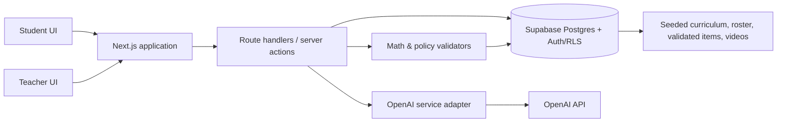
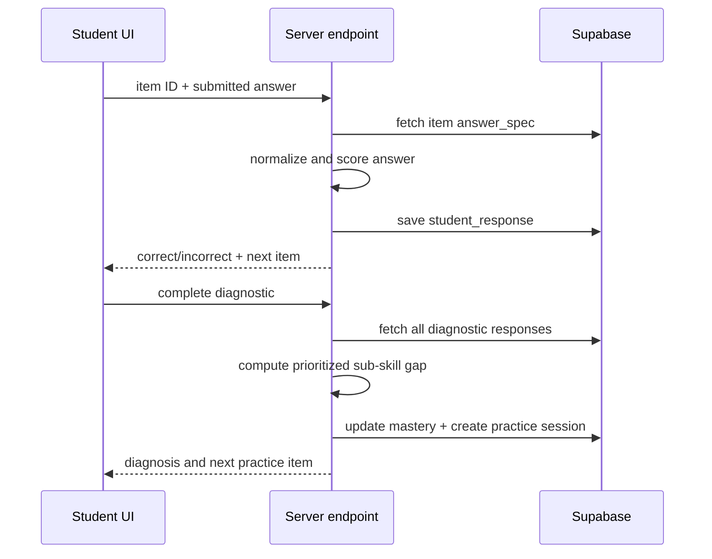

# Rung MVP Architecture

**Status:** Source of truth for the deployable post-hackathon MVP
**Last updated:** 2026-07-16
**Delivery target:** 2026-07-21  
**Team:** 2 builders

## 1. Purpose

Rung is a differentiated-instruction platform for middle-school math. In this MVP, a teacher-assigned fractions diagnostic identifies a student's missing sub-skills, assigns focused practice, offers non-answer-revealing tutor help, gives a still-stuck learner one bounded work-based coaching step, and turns class data into a teacher-ready small-group plan.

This document is the technical and product boundary for the build. When implementation choices conflict with this document, follow this document unless it is deliberately revised. New work belongs in the MVP only when it strengthens the end-to-end demo described in Section 4.

## 2. Confirmed product decisions

| Decision | Chosen approach |
| --- | --- |
| Learners | Middle-school students, grades 6–8 |
| Subject | Math |
| Beachhead | Fractions and rational-number operations |
| Demo narrative | Student experience first, teacher payoff second |
| Product scope | Deployable post-hackathon MVP; seeded classroom/content remains the canonical demo tenant |
| Deployment | Next.js on Vercel; Supabase Postgres + Auth; OpenAI API called only from server-side adapter |
| Authentication | Supabase Auth and RLS are required for production. `DEMO_MODE` is a separately gated rehearsal path, never a substitute for production authorization. |
| Core stack | Next.js + TypeScript, Supabase (Postgres), OpenAI API |
| Team / schedule | Two builders; ship by July 21, 2026 |

### Implementation defaults

These are intentional implementation choices for this MVP. A builder should not spend hackathon time evaluating alternatives.

| Concern | Default |
| --- | --- |
| UI styling | Tailwind CSS |
| Shared UI components | Small local component set; do not introduce a component library unless it accelerates a specific screen |
| Heatmap | Accessible custom CSS grid; avoid a charting dependency for this narrow matrix |
| Supabase client | Production browser client uses the anon key and authenticated session only; server modules use the user session for normal requests and the service role only for seed/admin work |
| OpenAI client | Official OpenAI JavaScript/TypeScript SDK, called only by the server-side AI adapter. `OPENAI_MODEL_WORK_ANALYSIS` may override the approved GPT-5.6 Luna route for work analysis; otherwise it inherits the approved default model. |
| Runtime validation | Zod schemas shared between API handlers and client form boundaries |
| Unit/integration test runner | Vitest |
| Browser end-to-end testing | Optional Playwright smoke test only after the core flow is complete |
| Database change management | Supabase migrations plus a repeatable local/demo seed script |
| Demo reset | Repeatable CLI seed/reset command; no production reset endpoint. A non-production endpoint is permitted only when environment-gated and separately authorized. |

## 3. MVP contract

The MVP must make this claim credibly:

> A single assignment can identify a specific prerequisite gap, give a student the next useful practice step, and give the teacher a concrete plan for the students who share that gap.

### In scope

- One fraction diagnostic, with a small fixed item bank.
- Diagnostic scoring and sub-skill diagnosis from answer patterns.
- A personalized, ordered practice set drawn from a validated bank.
- A three-level AI tutor hint ladder that does not give the final answer.
- One work-based help card after a recorded missed response and a learner-requested `hint` or `guided_step`; it offers a bounded coaching next step, not an answer.
- A seeded demo class, mastery records, teacher heatmap, and automatic groups.
- One generated mini-lesson plan for a selected group.
- Pre-vetted, pre-seeded video recommendations.
- Persisting the selected student's progress during the demo.

### Explicitly out of scope

- Rostering, LMS integration, parent accounts, and enterprise SSO beyond Supabase Auth.
- Multiple subjects, grade bands, units, or a general curriculum authoring system.
- Live internet/video search, transcript ingestion, or real-time recommendation crawling.
- Full spaced-repetition scheduling across days or weeks.
- User-generated peer solutions and associated moderation workflows.
- Mobile-native apps, offline support, notifications, and production analytics.
- Claiming instructional efficacy or using the app for high-stakes grading.

## 4. Demo-critical user journey

The interface should support a three-minute story without requiring teacher setup or live classroom-data entry. The visitor's short name is intentional temporary walkthrough input, not classroom setup.

The journey maps to a <3-minute script with the timing budget and AI-narration hooks below. Narrate GPT-5.6 and Codex usage throughout, not as a separate segment.

| Beat | Time | On screen | Narration hook |
| --- | --- | --- | --- |
| 1. A visitor starts a temporary non-production learner with a first name or nickname, then completes a five-question fixed fractions diagnostic. Maya remains the prepared fallback walkthrough. | ~40s | Name entry, then diagnostic one item at a time | Codex scaffolded the diagnostic flow, schema, and deterministic scorer |
| 2. The system reports a specific finding from the visitor's selected wrong answers, not simply that they missed a question. | (in ~40s) | Diagnosis screen | Deterministic rules select the supported tag; GPT-5.6 renders it in student-friendly language (§8) |
| 3. The visitor receives prerequisite practice and uses the tutor's nudge → hint → guided-step ladder on a hard item without being handed the answer. | ~40s | Practice + hint ladder | GPT-5.6 generates Socratic laddered hints; leak check keeps the answer hidden |
| 4. After the server records miss → `hint`/`guided_step` → later miss, the visitor uses **Show your work**: they type what they tried and may add a photo. Rung returns one observation, one next step, and one check question without telling them whether they are correct. | ~30s | Work-based help card | GPT-5.6 Luna reads only the request in memory; server leak checks keep the answer hidden and deterministic scoring remains authoritative |
| 5. Switch to the teacher dashboard: the heatmap shows several students share the common-denominator gap; select that group; Rung shows a 15–20 minute next-day mini-lesson with a matched practice set and one verified video. | ~45s | Teacher heatmap → group → plan | GPT-5.6 drafted the grouped mini-lesson; the video was pre-vetted by GPT-5.6 (§7); Codex built the dashboard and grouping |

The polished path must use seeded data and cached results. The demo must not depend on a live web search or on any model call for a result that is already required to appear.

## 5. Architecture at a glance



### Architectural principle

**The model suggests; deterministic application code decides what becomes visible or stored.**

The model can diagnose an error pattern, write hints, analyze learner-supplied work for one next move, and draft a lesson plan. It may not be the authority for answer correctness, item validity, permissions, mastery, or content progression. Those decisions are made from database records and deterministic validation code.

## 6. System boundaries

### Client: Next.js application

Responsibilities:

- Render the student diagnostic, practice, tutor, and conditional work-based help view.
- Render the teacher heatmap, groups, plan, and video recommendation.
- Keep transient interface state local: current question, active hint level, loading/error state.
- Submit answers, tutor requests, and work-help requests to server endpoints; never call Supabase with privileged credentials or call OpenAI directly.

The MVP may use the Next.js App Router with server components for read-heavy dashboard pages and client components only where interaction is needed.

### Server: Next.js route handlers / server actions

Responsibilities:

- Resolve the Supabase Auth session and enforce the caller's role, class membership, and student/teacher scope. In non-production `DEMO_MODE`, resolve either an explicitly allow-listed seed identity or a server-created temporary learner bound by an opaque httpOnly cookie; do not accept arbitrary client IDs.
- Coordinate scoring, mastery updates, practice progression, and model calls.
- Validate request shape and return stable, typed responses.
- Log model request metadata and failures without storing secrets.

All mutation and model workflows cross this boundary. Browser code must not decide that an answer is correct, that mastery changes, or that model output is safe to show.

### Data: Supabase Postgres

Supabase is the canonical store for curriculum, users, scored responses, mastery, groups, safe cached model outputs, video recommendations, and plan snapshots. Use migrations and a repeatable seed script so the demo tenant can be recreated.

Production uses Supabase Auth plus Row Level Security (RLS) from the first deployable release. A `profiles` row links each `auth.users` identity to a single application role. Students may read/write only their own responses, sessions, attempts, unlocks, and mastery; teachers may read only their classes and associated aggregate/group data; neither role receives service-role credentials. The service role stays server-only and is limited to migrations, seed/reset CLI work, and narrowly audited administrative jobs. `DEMO_MODE` fails closed in production. In non-production, a temporary participant is created server-side, enrolled in the demo class with a `not_started` mastery matrix, and resolved only through its opaque httpOnly cookie. Consent, deletion, and age-appropriate privacy review remain required before serving minors at scale.

### AI integration: OpenAI service adapter

One server-side module owns all OpenAI requests. It receives structured inputs and returns parsed, schema-validated outputs. Feature pages do not contain prompts.

The adapter is responsible for:

- Model selection and API request construction: GPT-5.6 Luna for routine tutor, work-analysis, and item-wrap calls; GPT-5.6 Terra for lower-volume diagnosis explanations and teacher lesson-plan drafts. `OPENAI_MODEL_WORK_ANALYSIS` is an optional server-only override for the approved Luna work-analysis route. Exact approved model IDs are environment-configured and allow-listed.
- Versioned prompt templates.
- Structured output parsing and schema validation.
- Timeouts, error handling, and a cached/seeded fallback for the demo.
- Recording the prompt version, model identifier, latency, outcome, and request ID when available.

Teacher lesson drafts receive only the stable group label, target sub-skill, student count, and matched-practice count. They must produce a concise 15–20 minute pencil-and-paper sequence: warm-up, teacher model, guided work, matched practice, and exit check. The model never determines membership, mastery, or the practice set, and it must not require special materials, quote student work, provide answer keys, or produce long multi-action directions.

Use the currently approved OpenAI model configured by an environment variable rather than hard-coding a model name. This keeps the architecture stable if the hackathon model changes.

### Cache and fallback policy

Option B is required: **live model call -> verified cache -> safe deterministic fallback**. The adapter calls the configured GPT-5.6 model first, validates the structured result and policy checks, then stores it as a verified cache entry. On timeout, API failure, invalid schema, or unsafe output, it uses only a matching verified cache entry; if none exists, it returns a feature-specific safe fallback. Tutor returns a non-answer-revealing deterministic hint; work analysis returns a generic observation, one next move, and one check question; diagnosis returns a seeded explanation of deterministic evidence; lesson planning returns a seeded plan. The UI may identify the response source but must not present a failed live call as model-generated.

Cache AI outputs by `feature`, the relevant stable entity (such as `item_id` or `teacher_group_id`), and `prompt_version`. Never use a cache entry created for a different item, sub-skill, or learner context. Work analysis additionally keys on one-way hashes of the typed work and optional image, never their raw values (see §9.3).

## 7. Domain model

### Curriculum hierarchy

The narrow curriculum is intentionally data-driven rather than inferred from free-form text.

```text
Topic: Fractions and rational-number operations
  └─ Sub-skill: Equivalent fractions
  └─ Sub-skill: Locate fractions on a number line
  └─ Sub-skill: Find a common denominator
  └─ Sub-skill: Add fractions with unlike denominators
  └─ Sub-skill: Subtract fractions with unlike denominators
```

Each item explicitly declares the sub-skill it assesses or practices. The app does not infer alignment at runtime.

### Core tables

| Table | Purpose | Key fields |
| --- | --- | --- |
| `students` | Seeded learner identities | `id`, `display_name`, `grade_band`, `is_demo_default` |
| `profiles` | Application identity linked to Supabase Auth | `id` (= `auth.users.id`), `role`, `student_id?`, `teacher_id?`, `demo_identity` |
| `classes` | Seeded demo classroom | `id`, `name`, `teacher_display_name` |
| `class_enrollments` | Student/class membership | `class_id`, `student_id` |
| `topics` | Top-level instructional unit | `id`, `slug`, `name` |
| `subskills` | Fine-grained skills | `id`, `topic_id`, `slug`, `name`, `description`, `prerequisite_subskill_id` |
| `items` | Validated diagnostic/practice questions | `id`, `subskill_id`, `item_type`, `prompt`, `answer_spec`, `visual_spec`, `solution_steps`, `difficulty`, `is_active`, `distractor_map` |
| `assignments` | Teacher-assigned diagnostic | `id`, `class_id`, `topic_id`, `title`, `mode` |
| `assignment_items` | Stable diagnostic order | `assignment_id`, `item_id`, `position` |
| `student_responses` | Every submitted diagnostic/practice answer | `id`, `student_id`, `item_id`, `answer_raw`, `is_correct`, `context`, `diagnostic_session_id`, `practice_session_id`, `practice_session_item_id`, `submitted_at` |
| `mastery` | Latest mastery status per student/sub-skill | `student_id`, `subskill_id`, `level`, `evidence_count`, `last_evaluated_at` |
| `practice_sessions` | Generated/selected practice sequence | `id`, `student_id`, `topic_id`, `status`, `diagnosis_snapshot`, `diagnostic_session_id`, `completed_at` |
| `practice_session_items` | Ordered selected practice items | `practice_session_id`, `item_id`, `position`, `status` |
| `diagnostic_completions` | Stable deterministic/AI-safe completion result | `diagnostic_session_id`, `selected_subskill_id`, `misconception_tag`, `evidence`, `explanation_source`, `completion_version` |
| `practice_plans` | Ordered generated plan metadata | `id`, `diagnostic_session_id`, explicit `position`, target skill, source/prompt/validator provenance |
| `generated_practice_items` | Parametric provenance for a persisted generated item | `item_id`, `practice_plan_id`, `position`, `parametric_spec`, `validator_version` |
| `practice_support_events` | Server-recorded support sequence metadata | occurrence/session IDs, `event_kind`, timestamp; never raw work or photos |
| `practice_support_state` | Derived support/claim state per logical item | session, item, learner, miss/hint/correct/claim timestamps; never raw work or photos |
| `demo_participant_sessions` | Non-production temporary learner session | `student_id`, `class_id`, one-way token hash, expiry/revocation timestamps |
| `attempt_submissions` | **Legacy compatibility only:** former peer-gate attempt records; not used by the current work-help flow | `id`, `student_id`, `item_id`, `attempt_text`, `verification_status`, `verification_reason` |
| `peer_solutions` | **Legacy compatibility only:** former curated worked examples; not rendered in the current student flow | `id`, `item_id`, `author_alias`, `approach_text`, `full_solution`, `is_vetted` |
| `peer_unlocks` | **Legacy compatibility only:** former peer-gate state; not read by the current student flow | `student_id`, `item_id`, `approach_unlocked_at`, `full_solution_unlocked_at` |
| `video_recommendations` | Pre-verified instructional videos | `id`, `subskill_id`, `title`, `provider`, `url`, `verification_note`, `is_active` |
| `teacher_groups` | Computed current grouping projection; optionally persisted for a selected plan | `id`, `class_id`, `subskill_id`, `label`, `generated_at` |
| `teacher_group_members` | Membership captured when a teacher selects/persists a group plan | `teacher_group_id`, `student_id` |
| `lesson_plans` | Cached/generated dated plan snapshot for a selected group | `id`, `teacher_group_id`, `content`, `prompt_version`, `status`, `generated_at` |
| `ai_runs` | Auditable model-call metadata; no raw attempt text | `id`, `feature`, `input_hash`, `prompt_version`, `model`, `status`, `latency_ms`, `output_json`, `created_at` |

`answer_spec` must be a structured JSON value such as a normalized fraction, accepted equivalent values, and validation method. It must not rely only on prose in the item prompt.

**Resurfacing storage note.** `practice_session_items` must support an item appearing at its original position and once later as a requeued occurrence. Use a row ID or explicit occurrence key rather than relying only on a `(practice_session_id, item_id)` uniqueness constraint.

`distractor_map` is the mechanism behind the product's core claim: diagnosis reads the *error pattern in wrong answers*, not just right/wrong. It maps each seeded wrong answer choice (or a recognizable wrong-answer form for free-entry items) to a predefined misconception tag — for example, `"3/7" → adds_numerators_and_denominators`. Diagnostic items must seed distractors whose selection is diagnostic, so that *which* wrong answer a student picks names the misconception. Misconception tags are drawn from a small fixed vocabulary aligned to the sub-skills in §7.

**Work-help privacy.** The current work-help flow does not create an attempt/work row. Typed work and an optional photo are processed only in request memory; they are never written to Supabase, `ai_runs`, application logs, cache values, or the HTTP response. `ai_runs` stores only one-way hashes and safe structured output/metadata. Legacy `attempt_submissions` retention remains a migration concern for any existing legacy records, not a reason to persist new work-help input.

### Schema delivery priority

The schema above describes the desired canonical model. The following tables are required before the complete demo path can work:

- `students`, `classes`, `class_enrollments`, `topics`, `subskills`, `items`
- `assignments`, `assignment_items`, `student_responses`, `mastery`, `diagnostic_completions`
- `practice_sessions`, `practice_session_items`, `practice_plans`, `generated_practice_items`
- `practice_support_events`, `practice_support_state`, `demo_participant_sessions`
- `video_recommendations`
- `ai_runs`

`ai_runs` is required from day one: the AI adapter records run metadata on every call (§6 AI integration), and the prompting requirements in §10 mandate an `ai_runs` record for every request. It is a single migration and must not be deferred; deferring it would leave §6, §7, and §10 without the logging sink they assume.

The dashboard computes group membership from current `mastery` on every read. When a teacher selects a group for planning, persist the membership and generated plan as a dated snapshot. The dashboard remains current while the selected plan stays stable and auditable.

When a teacher opens a student detail, the dashboard also provides teacher-safe response evidence grouped by sub-skill: the item prompt, the learner's submitted answer, the trusted correct/needs-follow-up result, and whether it came from the diagnostic or focused practice. This is an audit aid, not another scoring system. It deliberately excludes answer specifications, correct answers, solution steps, distractor maps, AI diagnosis/hint text, peer material, and raw typed/photo work. The local walkthrough reads this projection from process memory; the durable path reads server-scored `student_responses` joined to learner-safe item presentation fields.

## 8. Mastery and diagnostic rules

The hackathon needs explainable mastery, not a sophisticated but opaque learner model.

### Mastery levels

| Level | Meaning | Demo rule |
| --- | --- | --- |
| `not_started` | No evidence | No relevant response exists |
| `needs_support` | A prerequisite or target skill is not yet reliable | Diagnostic miss, or fewer than two correct practice responses |
| `developing` | Showing partial success | At least one correct targeted response after support |
| `mastered` | Ready to advance in this narrow sequence | Two correct responses at the chosen target difficulty with no unresolved prerequisite |

These thresholds are product-demo rules, not a claim of validated educational measurement. Make that distinction in presentation copy and code comments.

**Stability rule.** One later incorrect response never automatically downgrades `mastered`. Store it as new evidence and surface it for later review/recalibration; only an explicitly defined multi-evidence recalibration process may change a mastered level.

### Diagnostic algorithm

1. Score each response deterministically with the item's `answer_spec`.
2. Map missed items to their declared sub-skills, and map each wrong answer to its misconception tag via the item's `distractor_map`.
3. Select the highest-priority gap: missing prerequisite first; otherwise the most frequently missed target sub-skill.
4. Deterministically select one supported misconception tag from the evidence using the prerequisite-first rule. GPT-5.6 may render that already-selected diagnosis in student-friendly language, but it cannot select or introduce a tag.
5. On first completion only, project the server-scored diagnostic evidence into `mastery`: any miss becomes `needs_support`; all-correct evidence becomes `developing`; a diagnostic never directly grants `mastered`; an existing `mastered` level remains stable while its evidence count increases. Untouched sub-skills retain their current level.
6. Store the deterministic evidence (scores, sub-skill map, selected tag) and the AI explanation separately. The deterministic selection is auditable ground truth.

The local non-production fallback applies this same projection to its process-local `globalThis` mastery state so the teacher dashboard can show the temporary learner during one server lifetime. The durable path applies it atomically inside the locked Supabase diagnostic-completion finalizer, from stored `student_responses.is_correct` values only—not from browser or model-supplied evidence. In both modes, practice continues from that projected mastery state.

For the main demo student, the selected diagnosis must be stable: **finds no common denominator before adding fractions**. Seed answer choices and diagnostic mappings that reliably demonstrate this error.

### Practice selection algorithm

1. Identify every missed sub-skill, ordered prerequisite-first; each becomes a separately selectable practice plan rather than one mixed queue.
2. Request a structured 3–4 item plan for each skill. The model may choose only a supported kind: `number_line`, `equivalent_fraction`, `common_denominator`, or `fraction_operation` (addition/subtraction with unlike denominators).
3. Deterministically construct and validate every prompt and answer rule from the returned parameters. Reject the entire plan if any item is malformed, has the wrong kind for its skill, or fails its math constraint.
4. A rejected plan falls back as a whole to that skill's validated fallback plan; other skill plans from the same diagnostic remain unaffected.
5. The diagnosis result is the practice-plan hub. Completing one plan returns the learner to that hub, where completed plans stay visibly complete and remaining plans stay selectable. The no-Supabase fallback is process-local; the durable path persists the completion and its plan metadata.

For a durable learner, the server persists the complete validated 3–4 item plan atomically before returning it. Each plan has an explicit prerequisite-first `position`; retries read that position rather than timestamps, so the same ordered plan IDs are returned even if creation requests race.

### 8.1 Item generation pipeline

Questions are **generated, not hard-coded** — but the model is limited to a typed item grammar and deterministic code owns the prompt construction and answer rule, so the model can never invent a wrong answer key. Both halves run in the demo path.

1. **Typed parametric core (deterministic).** The supported grammar covers number lines, equivalent fractions, common denominators, and unlike-denominator addition/subtraction. A template derives the exact accepted-answer rule; common-denominator items accept any positive common multiple, not just the least common denominator. A number-line item also derives a safe visual specification: equal subdivisions and a labelled marked point. Its prompt asks the learner to identify that point; it must never print the accepted fraction in the question text.
2. **Optional LLM wrap (GPT-5.6).** The adapter can receive fixed operands and correct answer and propose a word-problem context, explicitly forbidden to change any number or introduce a second operation. This capability is not on the current seeded/rehearsal path; it must not replace a reviewed seed prompt until provenance and validator results are persisted.
3. **Validator (deterministic, mandatory).** Re-derive the answer implied by a generated or wrapped problem and confirm it equals the parametric answer, that no extra operation was introduced, and that the declared sub-skill still holds. On any failure, discard the candidate and use the bare parametric item from step 1. Nothing reaches a learner without passing this gate.
4. **Generate and cache for the demo.** The practice-plan adapter may generate operands live for a newly created learner session. Cache each validated plan by learner, selected gap, and prompt version. If the model is unavailable or validation fails, the demo uses the frozen validated bank immediately (§6 cache policy).

The number picker must be seedable/deterministic (no `Math.random()` in a way that breaks reproducibility) so a fresh seed reproduces the same demo items (§18).

**Re-wrap invariant.** If the LLM wording step is implemented, it may change only the learner-facing prompt. It must preserve the parametric item's ID, operands, computed answer, `answer_spec`, `distractor_map`, sub-skill, difficulty, and solution steps. Re-freezing updates the existing item record/cache key rather than creating a new ID.

**Within-session resurfacing.** Full multi-week spaced repetition stays out of scope (§3), but the retrieval-practice pedagogy is honored in miniature: an item answered incorrectly during a practice session is re-queued once, later in the same session, before the session is marked complete. A sub-skill still below `mastered` at session end is flagged on `/student/mastery` as "will come back," which is what the student-facing copy narrates as the resurfacing loop. This is a `practice_session_items.status` transition (`missed → requeued`), not a scheduler.

## 9. Critical workflows

### 9.1 Submit diagnostic answer



### 9.2 Tutor hint ladder

The tutor accepts only the current validated item, current learner answer/attempt, known sub-skill, and requested level.

| Level | Purpose | Constraint |
| --- | --- | --- |
| `nudge` | Focus attention on the relevant concept | No procedure or numerical intermediate answer |
| `hint` | Name the next operation or representation | May name a method; no completed calculation |
| `guided_step` | Ask for the next single step | May give one fill-in-the-blank or question; no final answer |

Before rendering a model response, run an answer-leak check. For this MVP it can be a deterministic comparison against known answer values and solution steps plus a constrained model prompt. If the check fails or the model errors, render a seeded safe hint for that item and level.

The tutor never accepts the model's assessment of mathematical correctness. Student answers are scored by `answer_spec`.

### 9.3 Work-based help after a missed response

This replaces the retired peer worked-example gate with individual, bounded coaching. A learner may receive one work-based help response only when the server has recorded this exact sequence for the same logical practice item:

1. A deterministically scored missed response.
2. A requested substantive `hint` or `guided_step` (a `nudge` does not qualify).
3. A later deterministically scored missed response after that support.

The server records these events against the owned, current practice-session occurrence and atomically reserves the one allowed work-help response before an AI call. The claim is logical-item scoped across a requeue, a correct response ends eligibility, and a failed model request releases the reservation. This sequence is enforced in both the local non-production fallback and the durable Supabase path; it is never inferred from browser state or a client-provided catalog item ID.

The card is titled **“Still stuck? Show your work.”** It has one required typed field, “What have you tried?”, and one optional photo field. The typed field asks for a first step, equation, diagram description, or strategy; it is not an answer field and never becomes scoring evidence. The card is not shown after a correct response, after a `nudge` alone, or as a replacement for deterministic answer checking.

`POST /api/work-help` is a server-authenticated multipart request. The current session-owned form sends `studentId`, `practiceSessionId`, `practiceSessionItemId`, `writtenWork`, and `supportLevel` (`hint` or `guided_step`), plus an optional `photo`; the server resolves the trusted item from that occurrence. A catalog `itemId` is legacy/advisory and cannot select a generated item. The route accepts only JPEG, PNG, or WebP uploads no larger than 5 MiB. It validates content type and image signature, converts an accepted image to an in-memory data URL only long enough to call the adapter, and does not write it to disk, Supabase Storage, database rows, logs, cache values, or the response.

The adapter sends the current safe item context, typed work, and optional image to GPT-5.6 Luna. Server-only protected answer values, answer-rule variants, and solution-step strings are used only for answer-leak checks and are not sent to the model. The returned `WorkAnalysis` is bounded to:

- `observation` — a supportive pattern the learner can examine;
- `nextStep` — one actionable next move; and
- `checkQuestion` — one question the learner can answer to continue.

The adapter may also report whether the image was `not_provided`, `readable`, or `unclear`. It must never score the work, update mastery, alter practice sequencing, unlock content, claim that an answer is correct or incorrect, return a final answer/full solution, quote the learner's work, or persist raw work/photo data. Deterministic `answer_spec` scoring remains the only correctness authority.

Before a result is shown, the server rejects any output that contains a protected answer, solution-step text, or generic answer-revealing language. The live/cache/fallback policy in §6 applies: a cache key contains only one-way hashes of work/image input, and the fallback gives an answer-safe generic next step. The user can retry; a model failure never changes their score or progress.

**Legacy compatibility.** Existing peer tables and peer endpoints may remain while migrations and old demo state are retired, but the current Student UI must not render a peer gate, call those routes, or reveal a peer approach/full solution.

### 9.4 Teacher group and tomorrow plan

1. Query `mastery` for the selected seeded class.
2. Group students with `needs_support` for the same sub-skill.
3. Persist the resulting group and members, ensuring a stable dashboard snapshot.
4. Retrieve a cached lesson plan for the selected group. If no cached plan exists, request a structured draft from the AI adapter and save it. The plan includes a matched practice set of validated bank items for the group's shared sub-skill.
5. Retrieve the matching pre-vetted video by `subskill_id`.

For the demo, pre-generate and seed the common-denominator group plan. The UI may still show that it was AI-generated, but must not wait on the model to make the moment work.


## 10. AI contracts and guardrails

AI output must be JSON validated against a TypeScript schema before it influences the UI or database.

| Feature | Input | Permitted output | Hard guardrail |
| --- | --- | --- | --- |
| Error-pattern diagnosis | Item IDs, correct/incorrect responses, declared skills, misconception tags from `distractor_map` | One supported misconception label and short explanation | Cannot alter scores, mastery evidence, or item alignment; cannot name a misconception without a seeded tag supporting it |
| Item wrap (§8.1) | Fixed operands, computed correct answer, sub-skill, difficulty | A word-problem context around the given numbers | May not change any number, the answer, or the operation; validator rejects any drift before the item is shown |
| Tutor | Current item, safe context, hint level | One hint at requested level | No final answer, no full solution, no unrelated tutoring |
| Work analysis | Safe item, learner's typed work, optional in-memory image; protected answers/steps remain server-only | One observation, one next step, one check question, optional image readability signal | Cannot score, update mastery, alter progress, quote learner work, or reveal an answer/solution |
| Lesson-plan draft | Group skill, sizes, aggregate evidence, duration | Objective, materials, timed steps, checks for understanding, and a matched practice set (references to validated bank `item_id`s for the group's sub-skill) | Must not invent student PII, claim evidence not provided, or reference an item not in the validated bank |
| Video vetting (offline/pre-build) | Candidate metadata/transcript and target skill | Relevance decision and rationale | Only recommendations already manually approved and seeded reach the app |

### 10.1 Shared AI contract

The exact adapter methods, result/fallback objects, cache behavior, and `ai_runs` requirements are defined in [contracts.md](./contracts.md#ai-adapter). Track A calls that contract; Track B alone implements live model behavior behind it. No feature module calls OpenAI directly or defines a competing result shape.

### Prompting requirements

- Prompts must state the learner grade band, target sub-skill, and known answer only when required for safety checking—not in tutor content generation if it would encourage leakage.
- Include an explicit “do not give the final answer or solve the item” instruction in the tutor system prompt.
- Request concise student-facing language, no shame-based language, and no claims about intelligence or effort.
- Include a prompt version identifier in every request and `ai_runs` record.
- Use structured output schemas rather than parsing prose.

### Failure behavior

| Failure | User-visible behavior |
| --- | --- |
| OpenAI timeout/error | Use a matching verified cache; if absent, use the feature-safe fallback and log the failure. Work analysis gives a generic, answer-safe next step and does not affect progress. |
| Output schema invalid | Discard it and use the same safe fallback |
| Suspected answer leakage | Do not show output; display a lower-level safe hint or “Try identifying the denominators first.” |
| Work photo unreadable | Say the photo could not be read clearly and use the typed work plus an answer-safe fallback next step |
| Database request fails | Show a retry state; do not present unsaved progress as complete |

## 11. API surface

Exact routing may evolve, but server operations must have these contracts.

| Operation | Request | Response |
| --- | --- | --- |
| `POST /api/demo/participant` | non-production `{ displayName }` | public temporary participant fields; sets opaque httpOnly cookie |
| `GET /api/demo/participant` | non-production participant cookie | current public participant fields, or missing/expired/invalid session status |
| `POST /api/responses` | authenticated actor, `itemId`, `answer`, `context` | `isCorrect`, normalized answer, response ID |
| `POST /api/diagnostics/:assignmentId/complete` | authenticated student | diagnosis, mastery snapshot, ordered selectable practice-plan cards |
| `GET /api/practice/:sessionId` | authenticated student | ordered practice item cards, excluding answers |
| `POST /api/tutor/hint` | authenticated student, owned `practiceSessionId` + `practiceSessionItemId`, `attempt`, `level` | safe hint for that session occurrence, source (`ai`, `cache`, or `fallback`) |
| `POST /api/work-help` | authenticated student, owned `practiceSessionId` + `practiceSessionItemId`, multipart typed work, optional JPEG/PNG/WebP photo (≤5 MiB), and support level | bounded observation, next step, check question, image-read signal, source metadata |
| `GET /api/classes/:classId/dashboard` | authenticated teacher | heatmap cells, current computed groups, selected group summary |
| `GET /api/teacher-groups/:groupId/plan` | authenticated teacher authorized for the group class | dated plan snapshot and matching video |

All request bodies are validated with shared schemas. Production identity and role come from the authenticated session, not a client-provided `studentId` or `classId`; routes also enforce RLS-compatible membership checks. `DEMO_MODE` is explicitly environment-gated and always disabled in production. In non-production it may resolve an allow-listed fictional seed identity or a server-created temporary participant bound by an opaque, httpOnly cookie.

### 11.1 Shared API contract

The exact request/response DTOs, route ownership, canonical IDs, and Phase-0 fixtures are defined in [contracts.md](./contracts.md#student-api). Track A owns route handlers/server actions. Track C uses only the checked-in shared schemas and fixtures until those handlers are live.

## 12. Frontend information architecture

### Student routes

- `/demo` — non-production, environment-gated walkthrough entry. A visitor enters a first name or nickname and receives a server-created, cookie-bound temporary learner identity. Maya remains an explicit secondary prepared walkthrough for rehearsal or recovery; an expired or invalid temporary session never falls through to Maya.
- `/student/diagnostic` — one item at a time; progress indicator; no feedback that reveals later items.
- `/student/diagnosis` — evidence-oriented plain language and a practice-plan hub: one selectable card per missed skill, with completed cards retained as completed when the learner returns from another plan.
- `/student/practice/[sessionId]` — item, answer submission, hint ladder, conditional “Still stuck? Show your work” card, progress.
- `/student/mastery` — narrow, plain-language skill status; sub-skills still below `mastered` are flagged “will come back” (the within-session resurfacing loop, §8); no misleading grade-level label.

### Teacher routes

- `/teacher/dashboard` — selected class, skill-by-student heatmap, concise legend, groups.
- `/teacher/groups/[groupId]` — group members, shared gap, mini-lesson, practice recommendation, vetted video.

Do not build an elaborate navigation system. A visible “Switch to teacher view” control at the end of student practice supports the demo flow. The teacher group route displays a loading skeleton immediately while its server lesson draft is prepared.

## 13. UI data contracts

The heatmap is a presentation of stored mastery—not a model-generated visualization. Each cell has:

- `studentId`
- `subskillId`
- `level` (`not_started`, `needs_support`, `developing`, `mastered`)
- `evidenceSummary` (for teacher drill-in)

Use accessible text labels in addition to color. Never rely on red/green alone to convey mastery state.

The student-facing diagnosis must distinguish between observation and interpretation:

- Observation: “On two questions, the denominators were added directly.”
- Next step: “Practice finding a common denominator before adding.”

Avoid labels such as “behind,” “bad at fractions,” or a calculated grade level.

An item may carry a learner-safe `visualSpec`. The current `number_line` visual has a denominator, marked numerator, and point label; it is descriptive geometry only. It is sent to the student separately from the server-only answer specification and rendered as a static, accessible diagram for identification questions.

Diagnostic items do not render a “Work it out” workspace, because the check-in measures independent performance. Targeted practice may render one skill-matched workspace: a static labelled number line is the question itself (not a second answer mechanism); equivalent-fraction items use a scale-factor table; unlike-denominator addition and subtraction use fraction bars. These workspaces can transfer a learner-entered result to the answer field but must never prefill or reveal the correct answer.

## 14. Seed dataset requirements

The demo dataset is a product asset, not placeholder data.

It must include:

- One class with 8–12 named-but-fictional students.
- Maya as the prepared secondary walkthrough and recovery path. The primary visitor path creates a fictional, temporary learner for the current non-production walkthrough.
- At least three students with the common-denominator gap, so the teacher group is convincing.
- At least one student in each visible mastery state to make the heatmap legible.
- Exactly five fixed, ordered diagnostic items that yield distinct, explainable error patterns, each with a `distractor_map` so a chosen wrong answer names a specific misconception. Maya's seeded responses must select the distractors mapped to the common-denominator misconception.
- At least four frozen, validated practice items for each possible demonstrated target skill.
- One video per featured sub-skill with provider, title, URL, and verification note.
- One 15–20 minute plan for the common-denominator teacher group.
- A rehearsed text-only work-help fallback for the primary practice item; optional demo photos are provided only at request time and are not seeded or retained.

The canonical seed is reviewed and reproducible. Runtime-generated practice plans use the §8.1 parametric core and validator before they are persisted. The optional LLM wrapping capability is not currently used to replace a seed prompt; it requires persisted provenance and validation before it may do so. `npm run seed` removes temporary learners and their runtime data before restoring the canonical class. All names, work samples, and responses must be fictional. Do not use real student information in local seeds, screenshots, prompts, or logs.

A temporary walkthrough cookie lasts eight hours. Expired durable participant rows are not yet removed by a scheduled cleanup job; `npm run seed` is the current explicit reset path. This is acceptable only for the fictional, non-production walkthrough and is not a retention design for real learners.

## 15. Reliability and safety checklist

- Every item passes the §8.1 validator (clean computed answer, no operation drift, correct sub-skill) before it can be shown or seeded — whether parametric or LLM-wrapped.
- Treat all model content as untrusted until schema and policy checks pass.
- Keep OpenAI and Supabase service keys in `.env.local`; commit only `.env.example` with variable names.
- Never expose service-role keys or OpenAI keys to the browser.
- Do not persist raw chain-of-thought or ask models to provide it.
- Do not log raw work-help text or photo bytes in console output or `ai_runs`; the current work-help path does not persist either input.
- Work-help accepts only JPEG, PNG, or WebP photos up to 5 MiB, processes them only in request memory, and uses only fictional/demo work in recordings.
- Rehearse the answer-safe fallback for every demo-critical diagnosis, tutor, work-analysis, lesson-plan, and item-generation moment.
- Include loading, retry, and fallback states for each AI-dependent interaction.
- Teacher mini-lessons must be usable with pencil and paper alone. Keep each timed activity short, concrete, and single-action so teachers can scan it while teaching.
- Provide a documented CLI command to reset the database to the canonical seed state before every rehearsal or recording. Do not expose a production reset endpoint.
- Use a clear prototype notice: not for grading, not a substitute for teacher judgment.

## 16. Testing strategy

Prioritize tests for trust boundaries over visual polish.

### Unit tests

- Fraction answer normalization and equivalence (`1/2`, `2/4`, mixed formatting as intentionally supported).
- Item scoring cannot accept a wrong answer as correct.
- Every number-line item has a visual specification, asks for the fraction represented by its labelled point, and does not state its accepted fraction in prompt text.
- Diagnostic mapping selects prerequisite gaps before target-only gaps.
- `distractor_map` resolves a seeded wrong answer to its misconception tag, and the diagnosis rejects any misconception label not backed by a collected tag.
- Practice selection respects skill order and yields only validated items.
- The parametric core computes the correct answer and misconception distractors for a template, and the §8.1 validator rejects an LLM-wrapped item whose answer, operation, or sub-skill drifted from the parametric skeleton.
- A missed practice item is re-queued once within the session before completion.
- One incorrect response after `mastered` does not automatically downgrade mastery.
- Work help is unavailable until the current item has a recorded miss and the learner has requested a `hint` or `guided_step`.
- Work-analysis output never scores a response, changes mastery, unlocks content, or exposes a protected answer/solution step.
- Tutor leakage checker rejects known final answers and solution-step strings.
- Teacher grouping returns the expected common-denominator cohort.

### Integration tests

- Maya's seeded diagnostic produces the canonical diagnosis and practice session.
- A complete student flow updates mastery and appears on the teacher dashboard.
- Model adapter schema failure produces a fallback response, not an app failure.
- The teacher group page returns its cached plan and vetted video with the OpenAI API unavailable.
- The item pipeline falls back to the bare parametric item when the LLM wrap fails validation, and the frozen demo set is reproduced identically from a fresh seed.
- Work help uses a verified cache or answer-safe fallback when the vision model is unavailable, and never scores correctness from an image or typed work alone.

### AI-output evals

The runtime string-compare leak check (§9.2) catches only verbatim answers; the spec's real worry (§10) is a model that paraphrases the answer past that check. Maintain a small fixture set — 10–20 generated tutor hints per level for the seeded items — asserting that no hint at any level states or restates the final answer, and that `guided_step` outputs never complete the calculation. Run this eval before every rehearsal. New failures block the tutor prompt version until fixed.

### Demo smoke test

Before recording or presenting, run the complete 3-minute journey using the same environment and seed state. Verify that no screen depends on a live web request and that every fallback is present.

## 17. Seven-day build order

| Date | Outcome | Owner suggestion |
| --- | --- | --- |
| Jul 14 | Project setup, Supabase schema/migrations, seed curriculum and class | Builder A: data; Builder B: UI shell |
| Jul 15 | Diagnostic UI, deterministic scoring, diagnosis and practice-session creation | Builder A: server/domain; Builder B: student flow |
| Jul 16 | Practice UI, tutor adapter with fallbacks, mastery updates | Builder A: AI/validation; Builder B: interaction polish |
| Jul 17 | Work-help safety boundary, safe fallback, and conditional student-card mount | Builder A: API/AI; Builder B: UI/copy |
| Jul 18 | Teacher heatmap, auto-grouping, seeded plan/video | Builder A: dashboard data; Builder B: dashboard UI |
| Jul 19 | Integrate full demo path, caching, test critical flows | Both |
| Jul 20 | Bug fixing, seed reset, responsive/accessibility pass, demo rehearsal | Both |
| Jul 21 | Final smoke test, record/present, preserve evidence of Codex/OpenAI use | Both |

This allocation is intentionally outcome-based. The builders should swap implementation ownership freely, but no one should begin stretch features before the Jul 19 integration outcome is complete.

**Daily throughout, not only on Jul 21:** keep a running `CODEX_LOG.md` noting each place Codex made a key decision or saved meaningful time, and capture the `/feedback` session ID from the session where the core loop was built. The submission asks for this evidence; reconstructing it on the final day loses most of it.

### 17.1 Parallel implementation addendum

The date-based schedule above remains the delivery timeline. This addendum defines the safe parallelization shape for that work.

**Phase 0 — one owner, serial and blocking.** Before feature tracks begin, ship the migrations, answer-spec normalizer/tests, deterministic parametric generator/validator, frozen seed data/mastery matrix, seed/reset command, shared IDs, and the adapter/API contracts in `contracts.md`. The LLM word-problem wrapper and photo help are not Phase-0 work.

After Phase 0 is merged, fan out without overlapping ownership:

- **Track A — Domain and API:** deterministic scoring, diagnosis evidence/tag collection, mastery updates, practice selection/requeue, the work-help route, and every API route/server action. It calls the AI contract but never OpenAI directly.
- **Track B — AI:** structured outputs, prompts, `ai_runs`, caches/fallbacks, tutor/work-analysis leakage checks and evals, diagnosis explanation, and LLM item wrapping. Wrapped items retain their original identifiers and deterministic answer data.
- **Track C — Student UI:** diagnostic, diagnosis, practice/hint/work-help, and mastery routes against the shared DTOs/fixtures.

**Phase F — integration.** One integration owner runs the cross-track tests and rehearsal: reset the seed, complete Maya's journey, verify that mastery reaches the heatmap/group, test the cached attempt-gate moment, and rehearse with OpenAI unavailable. Track owners fix failures in their own areas and record outcomes in `IMPLEMENTATION_LOG.md`.

The hard rule is that Tracks A, B, and C do not start until Phase-0 contracts and seed data are merged. This prevents schema, interface, and fixture collisions while retaining the original daily schedule.

## 18. Definition of done

The MVP is ready when all statements below are true:

- A fresh database seed produces the same credible demo class and prepared Maya fallback journey.
- A temporary walkthrough learner's server-owned diagnostic, practice, and mastery evidence appears in the teacher heatmap for the lifetime of the non-production demo session.
- The student flow completes from diagnostic through an answer-safe work-help escalation without manual database edits.
- Maya receives the specific common-denominator diagnosis based on deterministic answer evidence.
- Tutor help has three visible levels and never displays the final answer.
- Work help appears only after a recorded miss plus a requested `hint` or `guided_step`, and it never replaces answer checking.
- Work-analysis output cannot reveal a final answer or full worked solution.
- Teacher dashboard displays a heatmap and a group of students sharing the demonstrated gap.
- The group page displays a 15–20 minute plan and a pre-vetted video without a live web dependency.
- Model outage or malformed model output does not break the demo-critical journey.
- The app has no secrets committed to the repository and no real student data.
- The submission deliverables in §20 are complete: repo access, README Codex narrative, `/feedback` session ID, demo video, text description, and chosen category.

## 19. Deferred decisions

These are intentionally not decided for the hackathon MVP. Do not introduce them implicitly in the implementation.

- Real teacher authoring, assignment configuration, and curriculum import.
- A validated mastery model and research/evaluation protocol.
- Automated video ingestion and ongoing content review process.
- Production moderation for user-generated peer content.
- Full deletion, consent, privacy, and compliance controls required for minors beyond the 30-day attempt-retention boundary.
- A production sign-in/onboarding experience. The current production route boundary requires a Supabase Auth access token, but the browser login UI is intentionally not inferred from the non-production walkthrough.
- Pricing, district procurement, and LMS integrations.

When Rung moves beyond a prototype, these decisions require dedicated design and review rather than incremental feature work.

### 19.1 Multi-subject scaling roadmap (vision, not MVP)

This subsection records how Rung grows past one fractions topic, so the scale story is on record for judging and future planning. **None of it is built for the hackathon.** The MVP uses no vector database, no embeddings, and no semantic retrieval: "why an answer is wrong" is `answer_spec` scoring plus an exact `distractor_map` lookup plus bounded model classification into a curated tag set, all in relational Postgres. A vector layer is deliberately excluded now because the MVP domain (one topic, five sub-skills, a dozens-item bank) is small enough to enumerate, and a similarity layer would add an opaque failure mode without buying accuracy.

**The axis that matters is not subject count — it is checkable vs. open-response.**

| Concern | More checkable subjects (math, numeric science, grammar) | Open-response subjects (writing, reading, open explanation) |
| --- | --- | --- |
| Correctness | Still `answer_spec` (numeric/symbolic/MCQ/pattern), deterministic | Rubric grading by the model; no objective key |
| "Why it's wrong" | Distractor map + bounded classification into a curated taxonomy | Semantic; model reasons against a rubric, clustering discovers patterns |
| Trust spine | Holds intact — code decides | Breaks the clean line — the model *is* the grader; needs a new trust model |
| Vector layer | Supporting only (content, authoring, discovery) | Closer to the center (semantic diagnosis + retrieval) |

Adding more *checkable* subjects is a content-scale change, not an architectural one: the deterministic spine is a per-subject pattern that replicates. Open-response is the genuine architectural fork.

**The schema is already multi-subject shaped.** The `topic → subskill → item` hierarchy (§7) is not hard-coded to fractions, and `answer_spec` already carries a validation method. Going multi-subject in checkable domains is mostly: add a `subjects` table above `topics`; seed more of the same tables; build authoring tooling (the real cost — hand-authoring item banks and `distractor_map`s does not scale). `answer_spec.validation_method` is forward-compatible with an added `rubric` method for open-response later.

**Where a vector layer enters — always behind the deterministic decision spine, never in the grading hot path.** Implemented as `pgvector` inside the same Supabase Postgres, not new infrastructure:

- **Content retrieval** — embed `(sub-skill + misconception + grade)`, nearest-neighbor search a large video/worked-example library for *candidates*, then pass them through the same verification gate (§7, §10) before surfacing. The search proposes; the guardrail decides.
- **Authoring pipeline** — dedup near-identical items, retrieve similar items to seed generation.
- **Offline misconception discovery** — batch-embed the free-text "what did you try?" responses and novel wrong answers, cluster them, and have a human curate emergent clusters into new taxonomy tags. Runs offline, never on a graded answer.

**Open-response fork — what changes when writing/reading are added:** grading becomes rubric-based model judgment (store the rubric and rationale, not a boolean); diagnosis becomes semantic; auditability weakens, so new guardrails are mandatory — rubric transparency, confidence thresholds, human-in-the-loop for anything consequential, calibration against human graders, and no high-stakes grading (consistent with §19).

**Phased path that discards nothing:**

1. MVP — one topic, fully deterministic + `distractor_map`.
2. Fractions → all of middle-school math — replicate the pattern, build authoring tooling, add `pgvector` for content retrieval. Spine unchanged.
3. Adjacent checkable subjects — same spine, more taxonomies.
4. Open-response subjects — introduce rubric grading + semantic diagnosis + human-in-the-loop. The architecture extends here and the trust model is rebuilt.

## 20. Submission deliverables and judging access

The build is not done when the demo works; it is done when the submission is complete. These are graded artifacts, not paperwork — the README Codex narrative and the demo video's AI explanation feed directly into the technical-implementation and quality-of-idea scores. Prepare them alongside the build, not on the final day.

### Required deliverables

| Deliverable | Requirement | Owner note |
| --- | --- | --- |
| Category | Choose the category that best fits; Rung is **Education**. | Confirm on the submission form |
| Text description | Explains Rung's features and functionality (the §1 one-liner expanded into the §6 loops). | Reuse this doc's framing |
| Demo video | < 3 minutes, public on **YouTube**, with **audio** covering what was built and how Codex + GPT-5.6 were used. No third-party trademarks or copyrighted music without permission. | Script from §4's timing/narration table |
| Code repository | Public with a license, **or** private and shared with `testing@devpost.com` and `build-week-event@openai.com`. | Decide before submission opens; if private, add both viewers |
| README Codex narrative | Describe how you collaborated with Codex: where it accelerated the workflow, where **you** made key product/engineering/design decisions, and how GPT-5.6 and Codex shaped the result. | Draft from the running `CODEX_LOG.md` (§17) |
| `/feedback` Codex Session ID | The session ID from the thread where the **majority of core functionality** was built. | Capture it the day the core loop lands, not on Jul 21 |

### Judging access — what "testing" means here

Judges primarily watch the demo video and read the repository; there is **no requirement that a judge run this web app locally**. The "give judges a way to test without rebuilding" clause in the rules applies to **Plugins and Dev Tools**, which Rung is not. Optimize accordingly:

- **A deployed demo URL (Vercel) is the recommended courtesy**, not a requirement — it lets a judge click through the live app using our server-side keys, with no env setup and no secret sharing. This is the honest equivalent of a "demo instance."
- **Docker is not used.** There is no local-run-by-strangers requirement, and a container would not solve the real friction (OpenAI + Supabase secrets) that a cloning judge would hit. A deployed URL solves that instead.

### README quickstart (for the judge who does clone)

Keep it to four steps so a fresh clone runs without tribal knowledge:

1. `npm install` (Node version pinned via `.nvmrc` / `package.json` `engines`).
2. Copy `.env.example` to `.env.local` and fill in the OpenAI and Supabase values.
3. `npm run seed` to load the canonical demo class and content (§14).
4. `npm run dev`.

The seed/reset command (§15) is the local-runnability story; it must reproduce the exact demo state from a clean database.

### 20.1 Codex documentation workflow

Codex collaboration is a graded artifact, not paperwork: the README narrative feeds both the technical-implementation and quality-of-idea scores, and a single `/feedback` Codex Session ID must point to the thread where the majority of core functionality was built. What is scored is the *narrative and the code*, not raw chat logs — so the goal is to keep the collaboration legible and captured in the right place. Both builders follow the same process from day 1.

**One-thread rule.** Build the core loop — the student-loop trust boundary (scoring, diagnosis, tutor, work-help) — inside a single identifiable Codex thread. Only one session ID can be submitted, so the spine must not be scattered across throwaway threads. Side experiments may live elsewhere; the core build lives in one place.

**Session-ID capture.** Once the majority of the core loop is built, run `/feedback` in that thread and record the returned session ID in `CODEX_LOG.md` immediately. Verify the exact `/feedback` behavior in Codex itself, since it is Codex's own command. Do not defer this to Jul 21 — the thread must be identifiable when captured.

**Daily `CODEX_LOG.md`.** Append entries as you build, not at the end. Each entry names what Codex did *and* the decision the builder made around it:

```text
2026-07-15 — Diagnostic pipeline
- Codex: scaffolded Supabase schema + Zod validators for items/responses.
- Decision (me): distractor_map carries misconception tags so diagnosis reads
  the error pattern, not just right/wrong (§8).
- GPT-5.6: consumes those tags to name the specific misconception at runtime.
```

**What the README narrative must show.** For each major piece, tell a three-part story: (1) where Codex accelerated the work (scaffolding, schema, boilerplate, OpenAI wiring, tests); (2) where the builder made the key product/engineering/design call (the "model suggests, code decides" principle in §5, the trust boundaries, the scope cuts in §3); (3) where GPT-5.6 is load-bearing at runtime (error-pattern diagnosis, Socratic hints, attempt verification). The contrast — Codex sped the plumbing, the builders owned the pedagogy and safety architecture, GPT-5.6 does the per-student reasoning — is what the rubric rewards.

**Corroboration.** Commit often with messages that name decisions, and build the core loop in Codex rather than hand-typing then pasting, so git history and the submitted session thread tell the same story as the README.
