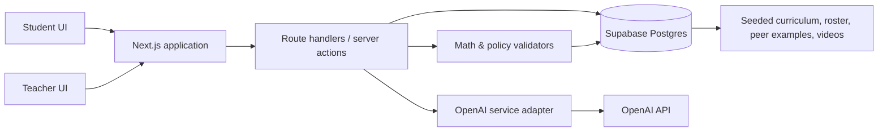
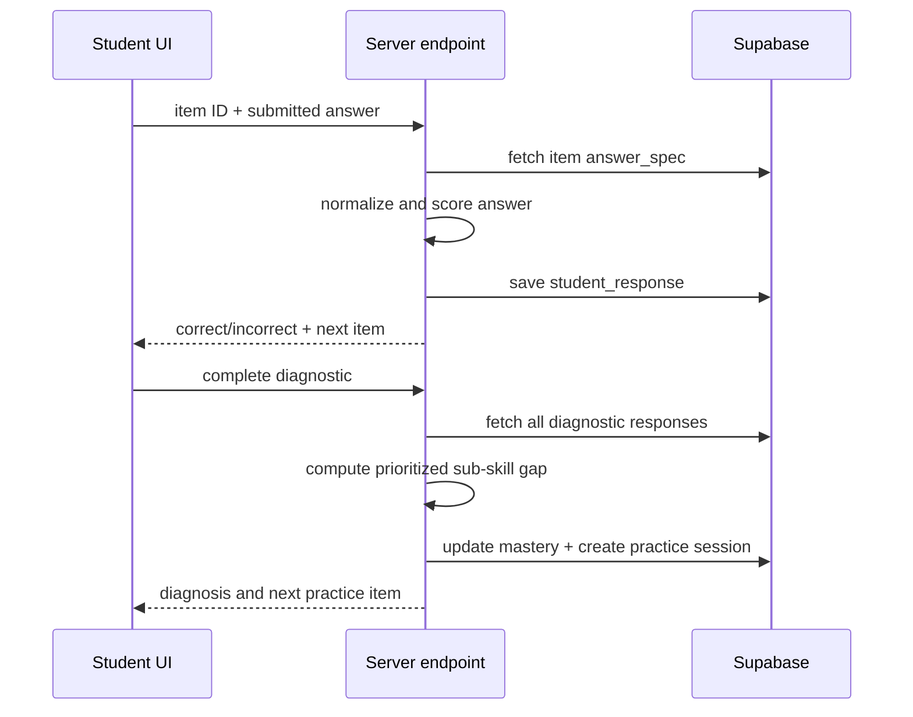

# Rung MVP Architecture

**Status:** Source of truth for the hackathon build  
**Last updated:** 2026-07-14  
**Delivery target:** 2026-07-21  
**Team:** 2 builders

## 1. Purpose

Rung is a differentiated-instruction platform for middle-school math. In this MVP, a teacher-assigned fractions diagnostic identifies a student's missing sub-skills, assigns focused practice, offers non-answer-revealing tutor help, gates peer worked examples behind a genuine attempt, and turns class data into a teacher-ready small-group plan.

This document is the technical and product boundary for the build. When implementation choices conflict with this document, follow this document unless it is deliberately revised. New work belongs in the MVP only when it strengthens the end-to-end demo described in Section 4.

## 2. Confirmed product decisions

| Decision | Chosen approach |
| --- | --- |
| Learners | Middle-school students, grades 6–8 |
| Subject | Math |
| Beachhead | Fractions and rational-number operations |
| Demo narrative | Student experience first, teacher payoff second |
| Product scope | Hackathon prototype; seeded classroom and seeded content |
| Authentication | Out of scope. Role and student identity are selected from demo data. |
| Core stack | Next.js + TypeScript, Supabase (Postgres), OpenAI API |
| Team / schedule | Two builders; ship by July 21, 2026 |

### Implementation defaults

These are intentional implementation choices for this MVP. A builder should not spend hackathon time evaluating alternatives.

| Concern | Default |
| --- | --- |
| UI styling | Tailwind CSS |
| Shared UI components | Small local component set; do not introduce a component library unless it accelerates a specific screen |
| Heatmap | Accessible custom CSS grid; avoid a charting dependency for this narrow matrix |
| Supabase client | `@supabase/supabase-js`, instantiated only in server-side modules for privileged data access |
| OpenAI client | Official OpenAI JavaScript/TypeScript SDK, called only by the server-side AI adapter |
| Runtime validation | Zod schemas shared between API handlers and client form boundaries |
| Unit/integration test runner | Vitest |
| Browser end-to-end testing | Optional Playwright smoke test only after the core flow is complete |
| Database change management | Supabase migrations plus a repeatable local/demo seed script |
| Demo reset | A documented seed/reset command; a dev-only reset endpoint is permitted if it makes rehearsal safer |

## 3. MVP contract

The MVP must make this claim credibly:

> A single assignment can identify a specific prerequisite gap, give a student the next useful practice step, and give the teacher a concrete plan for the students who share that gap.

### In scope

- One fraction diagnostic, with a small fixed item bank.
- Diagnostic scoring and sub-skill diagnosis from answer patterns.
- A personalized, ordered practice set drawn from a validated bank.
- A three-level AI tutor hint ladder that does not give the final answer.
- Attempt-gated peer worked examples using seeded solutions.
- A seeded demo class, mastery records, teacher heatmap, and automatic groups.
- One generated mini-lesson plan for a selected group.
- Pre-vetted, pre-seeded video recommendations.
- Persisting the selected student's progress during the demo.

### Explicitly out of scope

- Real authentication, rostering, LMS integration, or parent accounts.
- Multiple subjects, grade bands, units, or a general curriculum authoring system.
- Live internet/video search, transcript ingestion, or real-time recommendation crawling.
- Full spaced-repetition scheduling across days or weeks.
- User-generated peer solutions and associated moderation workflows.
- Mobile-native apps, offline support, notifications, and production analytics.
- Claiming instructional efficacy or using the app for high-stakes grading.

## 4. Demo-critical user journey

The interface should support a three-minute story without requiring setup or live data entry.

The journey maps to a <3-minute script with the timing budget and AI-narration hooks below. Narrate GPT-5.6 and Codex usage throughout, not as a separate segment.

| Beat | Time | On screen | Narration hook |
| --- | --- | --- | --- |
| 1. Select the seeded student **Maya Chen** from the demo roster; Maya completes a 4–5 question fractions diagnostic. | ~40s | Diagnostic, one item at a time | Codex scaffolded the diagnostic flow, schema, and deterministic scorer |
| 2. The system reports a specific finding: *Maya adds fractions without first finding a common denominator* — inferred from **which** wrong answers she chose, not just that she missed them. | (in ~40s) | Diagnosis screen | GPT-5.6 reads the `distractor_map` misconception tags to name the specific gap (§8) |
| 3. Maya receives practice for the prerequisite and uses the tutor's nudge → hint → guided-step ladder on a hard item without being handed the answer. | ~40s | Practice + hint ladder | GPT-5.6 generates Socratic laddered hints; leak check keeps the answer hidden |
| 4. Maya submits a meaningful attempt. The peer approach unlocks; the complete worked solution stays locked until Maya solves the item correctly. | ~30s | Attempt gate → peer approach | GPT-5.6 verifies the attempt is genuine and on-topic before unlocking |
| 5. Switch to the teacher dashboard: the heatmap shows several students share the common-denominator gap; select that group; Rung shows a 15–20 minute next-day mini-lesson with a matched practice set and one verified video. | ~45s | Teacher heatmap → group → plan | GPT-5.6 drafted the grouped mini-lesson; the video was pre-vetted by GPT-5.6 (§7); Codex built the dashboard and grouping |

The polished path must use seeded data and cached results. The demo must not depend on a live web search or on any model call for a result that is already required to appear.

## 5. Architecture at a glance



### Architectural principle

**The model suggests; deterministic application code decides what becomes visible or stored.**

The model can diagnose an error pattern, write hints, assess whether an attempt addresses the problem, and draft a lesson plan. It may not be the sole authority for answer correctness, item validity, permissions, or which content is unlocked. Those decisions are made from database records and deterministic validation code.

## 6. System boundaries

### Client: Next.js application

Responsibilities:

- Render the student diagnostic, practice, tutor, and peer-example views.
- Render the teacher heatmap, groups, plan, and video recommendation.
- Keep transient interface state local: current question, active hint level, loading/error state.
- Submit answers and attempts to server endpoints; never call Supabase with privileged credentials or call OpenAI directly.

The MVP may use the Next.js App Router with server components for read-heavy dashboard pages and client components only where interaction is needed.

### Server: Next.js route handlers / server actions

Responsibilities:

- Enforce the demo role and selected student context.
- Coordinate scoring, mastery updates, unlock decisions, and model calls.
- Validate request shape and return stable, typed responses.
- Log model request metadata and failures without storing secrets.

All mutation and model workflows cross this boundary. Browser code must not decide that an answer is correct or a peer solution may be unlocked.

### Data: Supabase Postgres

Supabase is the canonical store for curriculum, demo users, attempts, mastery, groups, cached model outputs, peer examples, and video recommendations. The initial build should use migrations and a repeatable seed script so the entire demo can be recreated.

Supabase Auth and Row Level Security are not required for this prototype because there are no real accounts. The database must still be accessed only from server-side code using environment-provided credentials. Before any real-user release, add authentication, RLS policies, consent/retention design, and a FERPA/COPPA review.

### AI integration: OpenAI service adapter

One server-side module owns all OpenAI requests. It receives structured inputs and returns parsed, schema-validated outputs. Feature pages do not contain prompts.

The adapter is responsible for:

- Model selection and API request construction.
- Versioned prompt templates.
- Structured output parsing and schema validation.
- Timeouts, error handling, and a cached/seeded fallback for the demo.
- Recording the prompt version, model identifier, latency, outcome, and request ID when available.

Use the currently approved OpenAI model configured by an environment variable rather than hard-coding a model name. This keeps the architecture stable if the hackathon model changes.

### Cache policy

Demo-critical AI results are seeded or cached before rehearsal. The application may make a live request when one is available, but the user-visible result must fall back immediately to the cached version on timeout, API failure, schema failure, or safety rejection.

Cache AI outputs by `feature`, the relevant stable entity (such as `item_id` or `teacher_group_id`), and `prompt_version`. Never use a cache entry created for a different item, sub-skill, or learner context. Attempt verification, whose input includes free-typed text, is additionally keyed by the normalized attempt text (see §9.3 demo reliability).

## 7. Domain model

### Curriculum hierarchy

The narrow curriculum is intentionally data-driven rather than inferred from free-form text.

```text
Topic: Fractions and rational-number operations
  └─ Sub-skill: Equivalent fractions
  └─ Sub-skill: Locate fractions on a number line
  └─ Sub-skill: Find a common denominator
  └─ Sub-skill: Add fractions with unlike denominators
  └─ Sub-skill: Subtract fractions with unlike denominators
```

Each item explicitly declares the sub-skill it assesses or practices. The app does not infer alignment at runtime.

### Core tables

| Table | Purpose | Key fields |
| --- | --- | --- |
| `students` | Seeded learner identities | `id`, `display_name`, `grade_band`, `is_demo_default` |
| `classes` | Seeded demo classroom | `id`, `name`, `teacher_display_name` |
| `class_enrollments` | Student/class membership | `class_id`, `student_id` |
| `topics` | Top-level instructional unit | `id`, `slug`, `name` |
| `subskills` | Fine-grained skills | `id`, `topic_id`, `slug`, `name`, `description`, `prerequisite_subskill_id` |
| `items` | Validated diagnostic/practice questions | `id`, `subskill_id`, `item_type`, `prompt`, `answer_spec`, `solution_steps`, `difficulty`, `is_active`, `distractor_map` |
| `assignments` | Teacher-assigned diagnostic | `id`, `class_id`, `topic_id`, `title`, `mode` |
| `assignment_items` | Stable diagnostic order | `assignment_id`, `item_id`, `position` |
| `student_responses` | Every submitted diagnostic/practice answer | `id`, `student_id`, `item_id`, `answer_raw`, `is_correct`, `context`, `submitted_at` |
| `mastery` | Latest mastery status per student/sub-skill | `student_id`, `subskill_id`, `level`, `evidence_count`, `last_evaluated_at` |
| `practice_sessions` | Generated/selected practice sequence | `id`, `student_id`, `topic_id`, `status`, `diagnosis_snapshot` |
| `practice_session_items` | Ordered selected practice items | `practice_session_id`, `item_id`, `position`, `status` |
| `attempt_submissions` | Text/numeric work submitted for peer gate | `id`, `student_id`, `item_id`, `attempt_text`, `verification_status`, `verification_reason` |
| `peer_solutions` | Curated, seeded worked examples | `id`, `item_id`, `author_alias`, `approach_text`, `full_solution`, `is_vetted` |
| `peer_unlocks` | Explicit gate state | `student_id`, `item_id`, `approach_unlocked_at`, `full_solution_unlocked_at` |
| `video_recommendations` | Pre-verified instructional videos | `id`, `subskill_id`, `title`, `provider`, `url`, `verification_note`, `is_active` |
| `teacher_groups` | Materialized groups for the demo class | `id`, `class_id`, `subskill_id`, `label`, `generated_at` |
| `teacher_group_members` | Group membership | `teacher_group_id`, `student_id` |
| `lesson_plans` | Cached/generated tomorrow plan | `id`, `teacher_group_id`, `content`, `prompt_version`, `status`, `generated_at` |
| `ai_runs` | Auditable model-call metadata | `id`, `feature`, `input_hash`, `prompt_version`, `model`, `status`, `latency_ms`, `output_json`, `created_at` |

`answer_spec` must be a structured JSON value such as a normalized fraction, accepted equivalent values, and validation method. It must not rely only on prose in the item prompt.

**Resurfacing storage note.** `practice_session_items` must support an item appearing at its original position and once later as a requeued occurrence. Use a row ID or explicit occurrence key rather than relying only on a `(practice_session_id, item_id)` uniqueness constraint.

`distractor_map` is the mechanism behind the product's core claim: diagnosis reads the *error pattern in wrong answers*, not just right/wrong. It maps each seeded wrong answer choice (or a recognizable wrong-answer form for free-entry items) to a predefined misconception tag — for example, `"3/7" → adds_numerators_and_denominators`. Diagnostic items must seed distractors whose selection is diagnostic, so that *which* wrong answer a student picks names the misconception. Misconception tags are drawn from a small fixed vocabulary aligned to the sub-skills in §7.

### Schema delivery priority

The schema above describes the desired canonical model. The following tables are required before the complete demo path can work:

- `students`, `classes`, `class_enrollments`, `topics`, `subskills`, `items`
- `assignments`, `assignment_items`, `student_responses`, `mastery`
- `practice_sessions`, `practice_session_items`
- `attempt_submissions`, `peer_solutions`, `peer_unlocks`
- `video_recommendations`
- `ai_runs`

`ai_runs` is required from day one: the AI adapter records run metadata on every call (§6 AI integration), and the prompting requirements in §10 mandate an `ai_runs` record for every request. It is a single migration and must not be deferred; deferring it would leave §6, §7, and §10 without the logging sink they assume.

`teacher_groups`, `teacher_group_members`, and `lesson_plans` should be added when their corresponding teacher feature is built. They must not delay the student diagnostic, practice, and peer-gate journey. If time is constrained, group membership may be calculated from `mastery` for the dashboard and then persisted later; the user-visible group must remain stable during a demo run.

## 8. Mastery and diagnostic rules

The hackathon needs explainable mastery, not a sophisticated but opaque learner model.

### Mastery levels

| Level | Meaning | Demo rule |
| --- | --- | --- |
| `not_started` | No evidence | No relevant response exists |
| `needs_support` | A prerequisite or target skill is not yet reliable | Diagnostic miss, or fewer than two correct practice responses |
| `developing` | Showing partial success | At least one correct targeted response after support |
| `mastered` | Ready to advance in this narrow sequence | Two correct responses at the chosen target difficulty with no unresolved prerequisite |

These thresholds are product-demo rules, not a claim of validated educational measurement. Make that distinction in presentation copy and code comments.

### Diagnostic algorithm

1. Score each response deterministically with the item's `answer_spec`.
2. Map missed items to their declared sub-skills, and map each wrong answer to its misconception tag via the item's `distractor_map`.
3. Select the highest-priority gap: missing prerequisite first; otherwise the most frequently missed target sub-skill.
4. The AI diagnosis reads the collected misconception tags and error pattern to (a) name the specific misconception it best explains and (b) render it in student-friendly language. This is the spec's headline reasoning task, not decoration — it consumes the `distractor_map` tags, not just the right/wrong vector.
5. Store the deterministic evidence (scores, sub-skill map, misconception tags) and the AI explanation separately. The tags are the auditable ground truth; the AI narrative may not introduce a misconception not supported by a seeded tag.

For the main demo student, the selected diagnosis must be stable: **finds no common denominator before adding fractions**. Seed answer choices and diagnostic mappings that reliably demonstrate this error.

### Practice selection algorithm

1. Identify the selected weak sub-skill and any direct unmet prerequisite.
2. Select 3–4 validated active items for that skill, beginning with the prerequisite where applicable.
3. Order from concrete/scaffolded to target-level difficulty.
4. Items come from the generation pipeline in §8.1, not a hand-typed bank. The demo replays a **frozen, pre-generated set** so the live moment is deterministic; the product may generate on demand because every item passes the validator before it is shown.

### 8.1 Item generation pipeline

Questions are **generated, not hard-coded** — but the math is owned by deterministic code and the language is owned by the model, so the model can never invent a wrong answer key. Both halves run in the demo path.

1. **Parametric core (deterministic).** A template plus a seeded number picker produces the item skeleton: the operands, the exact computed correct answer, and the misconception distractors computed from known wrong procedures (e.g., adding numerators and denominators yields `2/5 + 1/3 → 3/8`, tagged `adds_num_and_denom`). This step alone yields a valid, solvable item and its `distractor_map` for free — no LLM, no hallucination risk.
2. **LLM wrap (GPT-5.6).** The model is given the fixed operands and correct answer and asked to write a word-problem context around them, explicitly forbidden to change any number or introduce a second operation. This is where GPT-5.6 is load-bearing in item creation, and it is deliberately kept in the demo path.
3. **Validator (deterministic, mandatory).** Re-derive the answer implied by the wrapped problem and confirm it equals the parametric answer, that no extra operation was introduced, and that the declared sub-skill still holds. On any failure, discard and retry once, then fall back to the bare parametric item from step 1. Nothing reaches a learner without passing this gate.
4. **Freeze for the demo.** Pre-generate the exact items Maya and the seeded class see, run them through the validator, and cache them keyed by `item_id`. The demo never calls generation live for a required result (§6 cache policy).

The number picker must be seedable/deterministic (no `Math.random()` in a way that breaks reproducibility) so a fresh seed reproduces the same demo items (§18).

**Re-wrap invariant.** If the LLM wording step is implemented, it may change only the learner-facing prompt. It must preserve the parametric item's ID, operands, computed answer, `answer_spec`, `distractor_map`, sub-skill, difficulty, and solution steps. Re-freezing updates the existing item record/cache key rather than creating a new ID.

**Within-session resurfacing.** Full multi-week spaced repetition stays out of scope (§3), but the retrieval-practice pedagogy is honored in miniature: an item answered incorrectly during a practice session is re-queued once, later in the same session, before the session is marked complete. A sub-skill still below `mastered` at session end is flagged on `/student/mastery` as "will come back," which is what the student-facing copy narrates as the resurfacing loop. This is a `practice_session_items.status` transition (`missed → requeued`), not a scheduler.

## 9. Critical workflows

### 9.1 Submit diagnostic answer



### 9.2 Tutor hint ladder

The tutor accepts only the current validated item, current learner answer/attempt, known sub-skill, and requested level.

| Level | Purpose | Constraint |
| --- | --- | --- |
| `nudge` | Focus attention on the relevant concept | No procedure or numerical intermediate answer |
| `hint` | Name the next operation or representation | May name a method; no completed calculation |
| `guided_step` | Ask for the next single step | May give one fill-in-the-blank or question; no final answer |

Before rendering a model response, run an answer-leak check. For this MVP it can be a deterministic comparison against known answer values and solution steps plus a constrained model prompt. If the check fails or the model errors, render a seeded safe hint for that item and level.

The tutor never accepts the model's assessment of mathematical correctness. Student answers are scored by `answer_spec`.

### 9.3 Attempt-gated peer solution

1. Student submits an attempt and a short “What did you try?” explanation.
2. Server rejects empty, repeated-character, obviously unrelated, or too-short attempts deterministically.
3. The AI verifier receives the item, answer, and explanation and returns structured fields: `on_topic`, `non_trivial`, `reason`, `confidence`.
4. Server unlocks the peer **approach** only if deterministic checks pass and both model booleans are true.
5. Server unlocks the full worked solution only after deterministic answer scoring is correct.
6. Any verifier failure returns a constructive retry prompt, never a judgment of student motivation.

The UI must label this feature “See a peer’s approach” and explain the gate. Do not call it answer sharing.

**Demo reliability for the live attempt.** The presenter's attempt text at step 5 of §4 is typed live, so its verification cannot be cache-hit by `item_id` alone. To keep this — the demo's riskiest 30 seconds — from stalling:

- Seed the exact rehearsed attempt text for Maya's gated item and pre-cache its verification result keyed by `(item_id, normalized_attempt_text, prompt_version)`. Rehearse with that exact text.
- If the live attempt does not match the seeded text and the verifier call times out or errors, the deterministic pre-checks (non-empty, on-length, references the item's numbers) still run, and a documented **demo-mode** setting may treat a deterministically-valid attempt as verified rather than blocking. This is a demo affordance, disabled outside demo mode, and must be logged.
- The `verification_status = uncertain → do not unlock` rule in §10 applies to real use; demo mode's fallback resolves the contradiction between that rule and the pre-cache guarantee in §15.

### 9.4 Teacher group and tomorrow plan

1. Query `mastery` for the selected seeded class.
2. Group students with `needs_support` for the same sub-skill.
3. Persist the resulting group and members, ensuring a stable dashboard snapshot.
4. Retrieve a cached lesson plan for the selected group. If no cached plan exists, request a structured draft from the AI adapter and save it. The plan includes a matched practice set of validated bank items for the group's shared sub-skill.
5. Retrieve the matching pre-vetted video by `subskill_id`.

For the demo, pre-generate and seed the common-denominator group plan. The UI may still show that it was AI-generated, but must not wait on the model to make the moment work.

### 9.5 Photo of work → tutor help

A student stuck on an item may upload a photo of their handwritten work and ask for help. This extends the tutor rung (§6a "stuck → AI tutor"); it does not replace typed scoring.

1. The client uploads the image to a **Supabase Storage** bucket; the server sends it to a **vision-capable OpenAI model** with the current item context.
2. The model reads the work and feeds the **tutor hint ladder** (§9.2) — it identifies where the work went wrong and returns a hint at the requested level, never the answer. The same answer-leak check applies.
3. **Trust-boundary rule:** a vision reading of handwriting is fuzzy, so it lives in the **hint path (low stakes), never the scoring path.** Correctness is still decided by `answer_spec` on a typed or explicitly confirmed final answer. If the photo is used as the peer-gate attempt, the extracted answer must be **confirmed by the student** ("I see `3/8` — is that your answer?") before it is scored or verified.
4. **Demo safety:** live handwriting recognition can misread on stage, so pre-capture the demo photo(s), run them through the pipeline ahead of time, and cache the vision result keyed by a stable image hash. The live moment replays the cached reading; a fresh upload may call the model but must fall back to the cached hint on timeout, error, or low confidence.
5. **Privacy:** store the minimum image needed, strip it after the session, never log it, and use only fictional/demo work in seeds and recordings (§15).

This is a scoped stretch feature: it must not delay the core student journey (§8.1 through §9.3) and is cut first if the Jul 19 integration outcome is at risk.

## 10. AI contracts and guardrails

AI output must be JSON validated against a TypeScript schema before it influences the UI or database.

| Feature | Input | Permitted output | Hard guardrail |
| --- | --- | --- | --- |
| Error-pattern diagnosis | Item IDs, correct/incorrect responses, declared skills, misconception tags from `distractor_map` | One supported misconception label and short explanation | Cannot alter scores, mastery evidence, or item alignment; cannot name a misconception without a seeded tag supporting it |
| Item wrap (§8.1) | Fixed operands, computed correct answer, sub-skill, difficulty | A word-problem context around the given numbers | May not change any number, the answer, or the operation; validator rejects any drift before the item is shown |
| Tutor | Current item, safe context, hint level; optionally a vision reading of uploaded work (§9.5) | One hint at requested level | No final answer, no full solution, no unrelated tutoring |
| Attempt verifier | Current item, attempt, explanation | `on_topic`, `non_trivial`, brief retry/support message | Does not decide final-answer correctness |
| Lesson-plan draft | Group skill, sizes, aggregate evidence, duration | Objective, materials, timed steps, checks for understanding, and a matched practice set (references to validated bank `item_id`s for the group's sub-skill) | Must not invent student PII, claim evidence not provided, or reference an item not in the validated bank |
| Video vetting (offline/pre-build) | Candidate metadata/transcript and target skill | Relevance decision and rationale | Only recommendations already manually approved and seeded reach the app |

### 10.1 Shared AI contract

The exact adapter methods, result/fallback objects, cache behavior, and `ai_runs` requirements are defined in [contracts.md](./contracts.md#ai-adapter). Track A calls that contract; Track B alone implements live model behavior behind it. No feature module calls OpenAI directly or defines a competing result shape.

### Prompting requirements

- Prompts must state the learner grade band, target sub-skill, and known answer only when required for safety checking—not in tutor content generation if it would encourage leakage.
- Include an explicit “do not give the final answer or solve the item” instruction in the tutor system prompt.
- Request concise student-facing language, no shame-based language, and no claims about intelligence or effort.
- Include a prompt version identifier in every request and `ai_runs` record.
- Use structured output schemas rather than parsing prose.

### Failure behavior

| Failure | User-visible behavior |
| --- | --- |
| OpenAI timeout/error | Show an item-specific seeded hint, cached diagnosis, or cached plan; log the failure |
| Output schema invalid | Discard it and use the same safe fallback |
| Suspected answer leakage | Do not show output; display a lower-level safe hint or “Try identifying the denominators first.” |
| Attempt check uncertain | Ask student for a specific next step or explanation; do not unlock |
| Database request fails | Show a retry state; do not present unsaved progress as complete |

## 11. API surface

Exact routing may evolve, but server operations must have these contracts.

| Operation | Request | Response |
| --- | --- | --- |
| `POST /api/responses` | `studentId`, `itemId`, `answer`, `context` | `isCorrect`, normalized answer, response ID |
| `POST /api/diagnostics/:assignmentId/complete` | `studentId` | diagnosis, mastery snapshot, practice session ID |
| `GET /api/practice/:sessionId` | none | ordered practice item cards, excluding answers |
| `POST /api/tutor/hint` | `studentId`, `itemId`, `attempt`, `level` | safe hint, source (`ai` or `fallback`) |
| `POST /api/peer-attempts` | `studentId`, `itemId`, `attemptText`, `explanation` | verification status, approach unlock state, retry message |
| `GET /api/peer-solutions/:itemId` | `studentId` | only content permitted by `peer_unlocks` |
| `GET /api/classes/:classId/dashboard` | none | heatmap cells, stable groups, selected group summary |
| `GET /api/teacher-groups/:groupId/plan` | none | cached/generated plan and matching video |

All request bodies are validated with shared schemas. IDs are checked against the seeded demo data; do not trust a client-provided student or class ID merely because login is out of scope.

### 11.1 Shared API contract

The exact request/response DTOs, route ownership, canonical IDs, and Phase-0 fixtures are defined in [contracts.md](./contracts.md#student-api). Track A owns route handlers/server actions. Track C uses only the checked-in shared schemas and fixtures until those handlers are live.

## 12. Frontend information architecture

### Student routes

- `/demo` — role/student selector and “start Maya’s journey.”
- `/student/diagnostic` — one item at a time; progress indicator; no feedback that reveals later items.
- `/student/diagnosis` — exact gap, evidence-oriented plain language, “start practice.”
- `/student/practice/[sessionId]` — item, answer submission, hint ladder, peer approach gate, progress.
- `/student/mastery` — narrow, plain-language skill status; sub-skills still below `mastered` are flagged “will come back” (the within-session resurfacing loop, §8); no misleading grade-level label.

### Teacher routes

- `/teacher/dashboard` — selected class, skill-by-student heatmap, concise legend, groups.
- `/teacher/groups/[groupId]` — group members, shared gap, mini-lesson, practice recommendation, vetted video.

Do not build an elaborate navigation system. A visible “Switch to teacher view” control at the end of student practice supports the demo flow.

## 13. UI data contracts

The heatmap is a presentation of stored mastery—not a model-generated visualization. Each cell has:

- `studentId`
- `subskillId`
- `level` (`not_started`, `needs_support`, `developing`, `mastered`)
- `evidenceSummary` (for teacher drill-in)

Use accessible text labels in addition to color. Never rely on red/green alone to convey mastery state.

The student-facing diagnosis must distinguish between observation and interpretation:

- Observation: “On two questions, the denominators were added directly.”
- Next step: “Practice finding a common denominator before adding.”

Avoid labels such as “behind,” “bad at fractions,” or a calculated grade level.

## 14. Seed dataset requirements

The demo dataset is a product asset, not placeholder data.

It must include:

- One class with 8–12 named-but-fictional students.
- Maya as the primary walkthrough student.
- At least three students with the common-denominator gap, so the teacher group is convincing.
- At least one student in each visible mastery state to make the heatmap legible.
- 4–5 diagnostic items that yield distinct, explainable error patterns, each with a `distractor_map` so a chosen wrong answer names a specific misconception. Maya's seeded responses must select the distractors mapped to the common-denominator misconception.
- 3–4 practice items for each possible demonstrated target skill.
- 3–4 reviewed peer approaches for the primary practice item.
- One video per featured sub-skill with provider, title, URL, and verification note.
- One 15–20 minute plan for the common-denominator teacher group.
- One or two pre-captured photos of fictional handwritten work for the §9.5 photo-help demo, with their vision readings and hints pre-cached.

Diagnostic and practice items are produced by the §8.1 generation pipeline (parametric core + LLM wrap + validator) and then **frozen** into the seed, not hand-typed. "Seeded" here means the generated, validated demo set is captured so a fresh reset reproduces it exactly — the pipeline runs at authoring time, not on stage. All names, work samples, and responses must be fictional. Do not use real student information in local seeds, screenshots, prompts, or logs.

## 15. Reliability and safety checklist

- Every item passes the §8.1 validator (clean computed answer, no operation drift, correct sub-skill) before it can be shown or seeded — whether parametric or LLM-wrapped.
- Treat all model content as untrusted until schema and policy checks pass.
- Keep OpenAI and Supabase service keys in `.env.local`; commit only `.env.example` with variable names.
- Never expose service-role keys or OpenAI keys to the browser.
- Do not persist raw chain-of-thought or ask models to provide it.
- Store only the minimum attempt text needed for the demo; do not log raw student inputs in console output.
- For photo help (§9.5): store the minimum image, strip it after the session, never log it, and use only fictional handwritten work.
- Pre-cache all demo-critical diagnosis, tutor, attempt-verification, lesson-plan, item-generation, and photo-reading outputs.
- Include loading, retry, and fallback states for each AI-dependent interaction.
- Provide a documented command to reset the database to the canonical seed state before every rehearsal or recording.
- Use a clear prototype notice: not for grading, not a substitute for teacher judgment.

## 16. Testing strategy

Prioritize tests for trust boundaries over visual polish.

### Unit tests

- Fraction answer normalization and equivalence (`1/2`, `2/4`, mixed formatting as intentionally supported).
- Item scoring cannot accept a wrong answer as correct.
- Diagnostic mapping selects prerequisite gaps before target-only gaps.
- `distractor_map` resolves a seeded wrong answer to its misconception tag, and the diagnosis rejects any misconception label not backed by a collected tag.
- Practice selection respects skill order and yields only validated items.
- The parametric core computes the correct answer and misconception distractors for a template, and the §8.1 validator rejects an LLM-wrapped item whose answer, operation, or sub-skill drifted from the parametric skeleton.
- A missed practice item is re-queued once within the session before completion.
- Peer approach cannot unlock without a verified attempt.
- Full peer solution cannot unlock without a correct answer.
- Tutor leakage checker rejects known final answers and solution-step strings.
- Teacher grouping returns the expected common-denominator cohort.

### Integration tests

- Maya's seeded diagnostic produces the canonical diagnosis and practice session.
- A complete student flow updates mastery and appears on the teacher dashboard.
- Model adapter schema failure produces a fallback response, not an app failure.
- The teacher group page returns its cached plan and vetted video with the OpenAI API unavailable.
- The item pipeline falls back to the bare parametric item when the LLM wrap fails validation, and the frozen demo set is reproduced identically from a fresh seed.
- Photo help returns a cached hint (never a final answer) when the vision model is unavailable, and never scores correctness from the image alone.

### AI-output evals

The runtime string-compare leak check (§9.2) catches only verbatim answers; the spec's real worry (§10) is a model that paraphrases the answer past that check. Maintain a small fixture set — 10–20 generated tutor hints per level for the seeded items — asserting that no hint at any level states or restates the final answer, and that `guided_step` outputs never complete the calculation. Run this eval before every rehearsal. New failures block the tutor prompt version until fixed.

### Demo smoke test

Before recording or presenting, run the complete 3-minute journey using the same environment and seed state. Verify that no screen depends on a live web request and that every fallback is present.

## 17. Seven-day build order

| Date | Outcome | Owner suggestion |
| --- | --- | --- |
| Jul 14 | Project setup, Supabase schema/migrations, seed curriculum and class | Builder A: data; Builder B: UI shell |
| Jul 15 | Diagnostic UI, deterministic scoring, diagnosis and practice-session creation | Builder A: server/domain; Builder B: student flow |
| Jul 16 | Practice UI, tutor adapter with fallbacks, mastery updates | Builder A: AI/validation; Builder B: interaction polish |
| Jul 17 | Attempt gate, seeded peer approaches, unlock rules | Builder A: API/rules; Builder B: UI/copy |
| Jul 18 | Teacher heatmap, auto-grouping, seeded plan/video | Builder A: dashboard data; Builder B: dashboard UI |
| Jul 19 | Integrate full demo path, caching, test critical flows | Both |
| Jul 20 | Bug fixing, seed reset, responsive/accessibility pass, demo rehearsal | Both |
| Jul 21 | Final smoke test, record/present, preserve evidence of Codex/OpenAI use | Both |

This allocation is intentionally outcome-based. The builders should swap implementation ownership freely, but no one should begin stretch features before the Jul 19 integration outcome is complete.

**Daily throughout, not only on Jul 21:** keep a running `CODEX_LOG.md` noting each place Codex made a key decision or saved meaningful time, and capture the `/feedback` session ID from the session where the core loop was built. The submission asks for this evidence; reconstructing it on the final day loses most of it.

### 17.1 Parallel implementation addendum

The date-based schedule above remains the delivery timeline. This addendum defines the safe parallelization shape for that work.

**Phase 0 — one owner, serial and blocking.** Before feature tracks begin, ship the migrations, answer-spec normalizer/tests, deterministic parametric generator/validator, frozen seed data/mastery matrix, seed/reset command, shared IDs, and the adapter/API contracts in `contracts.md`. The LLM word-problem wrapper and photo help are not Phase-0 work.

After Phase 0 is merged, fan out without overlapping ownership:

- **Track A — Domain and API:** deterministic scoring, diagnosis evidence/tag collection, mastery updates, practice selection/requeue, peer unlock rules, and every API route/server action. It calls the AI contract but never OpenAI directly.
- **Track B — AI:** structured outputs, prompts, `ai_runs`, caches/fallbacks, tutor leakage checks/evals, diagnosis explanation, attempt verification, and LLM item wrapping. Wrapped items retain their original identifiers and deterministic answer data.
- **Track C — Student UI:** diagnostic, diagnosis, practice/hint/peer gate, and mastery routes against the shared DTOs/fixtures. Photo help is outside this track and is cut before it threatens the core demo.

**Phase F — integration.** One integration owner runs the cross-track tests and rehearsal: reset the seed, complete Maya's journey, verify that mastery reaches the heatmap/group, test the cached attempt-gate moment, and rehearse with OpenAI unavailable. Track owners fix failures in their own areas and record outcomes in `IMPLEMENTATION_LOG.md`.

The hard rule is that Tracks A, B, and C do not start until Phase-0 contracts and seed data are merged. This prevents schema, interface, and fixture collisions while retaining the original daily schedule.

## 18. Definition of done

The MVP is ready when all statements below are true:

- A fresh database seed produces the same credible demo class and Maya journey.
- The student flow completes from diagnostic through a gated peer approach without manual database edits.
- Maya receives the specific common-denominator diagnosis based on deterministic answer evidence.
- Tutor help has three visible levels and never displays the final answer.
- A poor-quality attempt does not unlock a peer approach; a meaningful attempt does.
- A correct answer, and only a correct answer, unlocks the complete worked example.
- Teacher dashboard displays a heatmap and a group of students sharing the demonstrated gap.
- The group page displays a 15–20 minute plan and a pre-vetted video without a live web dependency.
- Model outage or malformed model output does not break the demo-critical journey.
- The app has no secrets committed to the repository and no real student data.
- The submission deliverables in §20 are complete: repo access, README Codex narrative, `/feedback` session ID, demo video, text description, and chosen category.

## 19. Deferred decisions

These are intentionally not decided for the hackathon MVP. Do not introduce them implicitly in the implementation.

- Authentication provider, role permissions, and multi-tenant school data model.
- Real teacher authoring, assignment configuration, and curriculum import.
- A validated mastery model and research/evaluation protocol.
- Automated video ingestion and ongoing content review process.
- Production moderation for user-generated peer content.
- Data retention, deletion, consent, privacy, and compliance controls required for minors.
- Pricing, district procurement, and LMS integrations.

When Rung moves beyond a prototype, these decisions require dedicated design and review rather than incremental feature work.

### 19.1 Multi-subject scaling roadmap (vision, not MVP)

This subsection records how Rung grows past one fractions topic, so the scale story is on record for judging and future planning. **None of it is built for the hackathon.** The MVP uses no vector database, no embeddings, and no semantic retrieval: "why an answer is wrong" is `answer_spec` scoring plus an exact `distractor_map` lookup plus bounded model classification into a curated tag set, all in relational Postgres. A vector layer is deliberately excluded now because the MVP domain (one topic, five sub-skills, a dozens-item bank) is small enough to enumerate, and a similarity layer would add an opaque failure mode without buying accuracy.

**The axis that matters is not subject count — it is checkable vs. open-response.**

| Concern | More checkable subjects (math, numeric science, grammar) | Open-response subjects (writing, reading, open explanation) |
| --- | --- | --- |
| Correctness | Still `answer_spec` (numeric/symbolic/MCQ/pattern), deterministic | Rubric grading by the model; no objective key |
| "Why it's wrong" | Distractor map + bounded classification into a curated taxonomy | Semantic; model reasons against a rubric, clustering discovers patterns |
| Trust spine | Holds intact — code decides | Breaks the clean line — the model *is* the grader; needs a new trust model |
| Vector layer | Supporting only (content, authoring, discovery) | Closer to the center (semantic diagnosis + retrieval) |

Adding more *checkable* subjects is a content-scale change, not an architectural one: the deterministic spine is a per-subject pattern that replicates. Open-response is the genuine architectural fork.

**The schema is already multi-subject shaped.** The `topic → subskill → item` hierarchy (§7) is not hard-coded to fractions, and `answer_spec` already carries a validation method. Going multi-subject in checkable domains is mostly: add a `subjects` table above `topics`; seed more of the same tables; build authoring tooling (the real cost — hand-authoring item banks and `distractor_map`s does not scale). `answer_spec.validation_method` is forward-compatible with an added `rubric` method for open-response later.

**Where a vector layer enters — always behind the deterministic decision spine, never in the grading hot path.** Implemented as `pgvector` inside the same Supabase Postgres, not new infrastructure:

- **Content retrieval** — embed `(sub-skill + misconception + grade)`, nearest-neighbor search a large video/worked-example library for *candidates*, then pass them through the same verification gate (§7, §10) before surfacing. The search proposes; the guardrail decides.
- **Authoring pipeline** — dedup near-identical items, retrieve similar items to seed generation.
- **Offline misconception discovery** — batch-embed the free-text "what did you try?" responses and novel wrong answers, cluster them, and have a human curate emergent clusters into new taxonomy tags. Runs offline, never on a graded answer.

**Open-response fork — what changes when writing/reading are added:** grading becomes rubric-based model judgment (store the rubric and rationale, not a boolean); diagnosis becomes semantic; auditability weakens, so new guardrails are mandatory — rubric transparency, confidence thresholds, human-in-the-loop for anything consequential, calibration against human graders, and no high-stakes grading (consistent with §19).

**Phased path that discards nothing:**

1. MVP — one topic, fully deterministic + `distractor_map`.
2. Fractions → all of middle-school math — replicate the pattern, build authoring tooling, add `pgvector` for content retrieval. Spine unchanged.
3. Adjacent checkable subjects — same spine, more taxonomies.
4. Open-response subjects — introduce rubric grading + semantic diagnosis + human-in-the-loop. The architecture extends here and the trust model is rebuilt.

## 20. Submission deliverables and judging access

The build is not done when the demo works; it is done when the submission is complete. These are graded artifacts, not paperwork — the README Codex narrative and the demo video's AI explanation feed directly into the technical-implementation and quality-of-idea scores. Prepare them alongside the build, not on the final day.

### Required deliverables

| Deliverable | Requirement | Owner note |
| --- | --- | --- |
| Category | Choose the category that best fits; Rung is **Education**. | Confirm on the submission form |
| Text description | Explains Rung's features and functionality (the §1 one-liner expanded into the §6 loops). | Reuse this doc's framing |
| Demo video | < 3 minutes, public on **YouTube**, with **audio** covering what was built and how Codex + GPT-5.6 were used. No third-party trademarks or copyrighted music without permission. | Script from §4's timing/narration table |
| Code repository | Public with a license, **or** private and shared with `testing@devpost.com` and `build-week-event@openai.com`. | Decide before submission opens; if private, add both viewers |
| README Codex narrative | Describe how you collaborated with Codex: where it accelerated the workflow, where **you** made key product/engineering/design decisions, and how GPT-5.6 and Codex shaped the result. | Draft from the running `CODEX_LOG.md` (§17) |
| `/feedback` Codex Session ID | The session ID from the thread where the **majority of core functionality** was built. | Capture it the day the core loop lands, not on Jul 21 |

### Judging access — what "testing" means here

Judges primarily watch the demo video and read the repository; there is **no requirement that a judge run this web app locally**. The "give judges a way to test without rebuilding" clause in the rules applies to **Plugins and Dev Tools**, which Rung is not. Optimize accordingly:

- **A deployed demo URL (Vercel) is the recommended courtesy**, not a requirement — it lets a judge click through the live app using our server-side keys, with no env setup and no secret sharing. This is the honest equivalent of a "demo instance."
- **Docker is not used.** There is no local-run-by-strangers requirement, and a container would not solve the real friction (OpenAI + Supabase secrets) that a cloning judge would hit. A deployed URL solves that instead.

### README quickstart (for the judge who does clone)

Keep it to four steps so a fresh clone runs without tribal knowledge:

1. `npm install` (Node version pinned via `.nvmrc` / `package.json` `engines`).
2. Copy `.env.example` to `.env.local` and fill in the OpenAI and Supabase values.
3. `npm run seed` to load the canonical demo class and content (§14).
4. `npm run dev`.

The seed/reset command (§15) is the local-runnability story; it must reproduce the exact demo state from a clean database.

### 20.1 Codex documentation workflow

Codex collaboration is a graded artifact, not paperwork: the README narrative feeds both the technical-implementation and quality-of-idea scores, and a single `/feedback` Codex Session ID must point to the thread where the majority of core functionality was built. What is scored is the *narrative and the code*, not raw chat logs — so the goal is to keep the collaboration legible and captured in the right place. Both builders follow the same process from day 1.

**One-thread rule.** Build the core loop — the student-loop trust boundary (scoring, diagnosis, tutor, attempt gate) — inside a single identifiable Codex thread. Only one session ID can be submitted, so the spine must not be scattered across throwaway threads. Side experiments may live elsewhere; the core build lives in one place.

**Session-ID capture.** Once the majority of the core loop is built, run `/feedback` in that thread and record the returned session ID in `CODEX_LOG.md` immediately. Verify the exact `/feedback` behavior in Codex itself, since it is Codex's own command. Do not defer this to Jul 21 — the thread must be identifiable when captured.

**Daily `CODEX_LOG.md`.** Append entries as you build, not at the end. Each entry names what Codex did *and* the decision the builder made around it:

```text
2026-07-15 — Diagnostic pipeline
- Codex: scaffolded Supabase schema + Zod validators for items/responses.
- Decision (me): distractor_map carries misconception tags so diagnosis reads
  the error pattern, not just right/wrong (§8).
- GPT-5.6: consumes those tags to name the specific misconception at runtime.
```

**What the README narrative must show.** For each major piece, tell a three-part story: (1) where Codex accelerated the work (scaffolding, schema, boilerplate, OpenAI wiring, tests); (2) where the builder made the key product/engineering/design call (the "model suggests, code decides" principle in §5, the trust boundaries, the scope cuts in §3); (3) where GPT-5.6 is load-bearing at runtime (error-pattern diagnosis, Socratic hints, attempt verification). The contrast — Codex sped the plumbing, the builders owned the pedagogy and safety architecture, GPT-5.6 does the per-student reasoning — is what the rubric rewards.

**Corroboration.** Commit often with messages that name decisions, and build the core loop in Codex rather than hand-typing then pasting, so git history and the submitted session thread tell the same story as the README.
